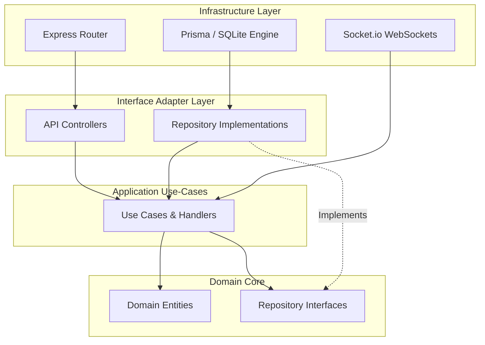
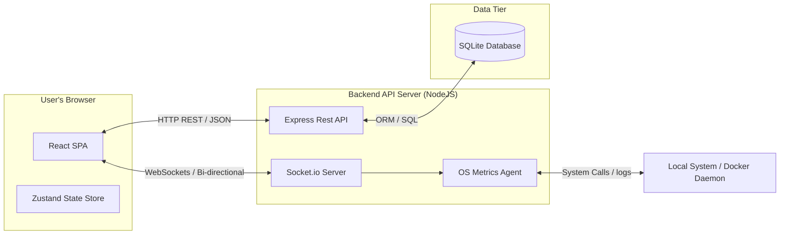
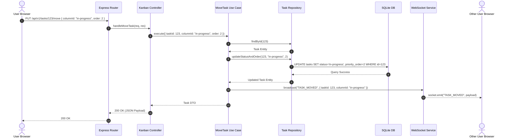

# DevOps Learning Portal (DaemonBoard) — Phase 1: Software Architecture

This document specifies the software architecture, package structures, module boundaries, patterns, and coding standards for the **DevOps Learning Portal** (DaemonBoard). 

---

## 1. Clean Architecture Model

We use the Clean Architecture pattern to segregate business logic from frameworks, delivery mechanisms, and database structures.

```
                  ┌──────────────────────────────────────────────┐
                  │                 INFRASTRUCTURE               │
                  │   Express.js, Knex/Prisma, SQLite/Postgres   │
                  │   ┌──────────────────────────────────────┐   │
                  │   │          INTERFACE ADAPTERS          │   │
                  │   │     Controllers, Repositories, WS    │   │
                  │   │   ┌──────────────────────────────┐   │   │
                  │   │   │         USE CASE LAYER       │   │   │
                  │   │   │      Application Services    │   │   │
                  │   │   │   ┌──────────────────────┐   │   │   │
                  │   │   │   │     DOMAIN LAYER     │   │   │   │
                  │   │   │   │  Entities, Interfaces│   │   │   │
                  │   │   │   └──────────────────────┘   │   │   │
                  │   │   └──────────────────────────────┘   │   │
                  │   └──────────────────────────────────────┘   │
                  └──────────────────────────────────────────────┘
```

- **Domain Layer**: The core of the application. Contains domain entities, value objects, domain logic, and domain interface contracts (e.g., Repository interface blueprints). It has zero dependencies on any external framework, ORM, or package.
- **Use Case Layer**: Contains application-specific business logic. Orchestrates entities and coordinates data flows to and from ports (interfaces). Depends *only* on the Domain Layer.
- **Interface Adapters**: Translates data between Use Cases and Infrastructure. Includes Express controllers (HTTP mapping), database repository implementations, and WebSocket message publishers/subscribers.
- **Infrastructure Layer**: Contains the database engine setups, routing frameworks, file system drivers, and environment configurations.

---

## 2. Directory Structure

We adopt a monorepo workspace containing separate folders for the API server (`backend`), the web dashboard (`frontend`), and shared documentation.

```
/daemonboard
│
├── docs/                             # Architecture and project planning documentation
│   ├── vision.md                     # Vision & requirements specification
│   └── architecture.md               # [This file] Architectural specification
│
├── backend/                          # Backend API Server (NodeJS + Express + TS)
│   ├── src/
│   │   ├── domain/                   # Enterprise Business Rules & Entities
│   │   │   ├── entities/             # Domain objects (User, Project, Task, Roadmap, Note)
│   │   │   └── repositories/         # Abstract interfaces for repository queries
│   │   │
│   │   ├── application/              # Application Business Rules (Use Cases)
│   │   │   ├── use-cases/            # Command/Query orchestrations
│   │   │   └── services/             # Use-case specific service interfaces
│   │   │
│   │   ├── infrastructure/           # Frameworks, Drivers, and Adapters
│   │   │   ├── controllers/          # Express route handler entrypoints
│   │   │   ├── database/             # SQLite/PostgreSQL connection engines & schema migrations
│   │   │   ├── repositories/         # Concrete repository implementations (Prisma/Knex)
│   │   │   ├── websocket/            # Socket.io events and server configurations
│   │   │   ├── config/               # Environment variable handlers and schemas
│   │   │   └── logger/               # Winston/Pino logger setup
│   │   │
│   │   ├── shared/                   # Cross-cutting utilities and error declarations
│   │   │   ├── errors/               # Custom application exceptions
│   │   │   └── utils/                # Helper functions
│   │   │
│   │   ├── app.ts                    # Express application configuration
│   │   └── server.ts                 # HTTP and WebSocket Server runner
│   │
│   ├── tests/                        # Backend Unit & Integration tests
│   ├── package.json
│   └── tsconfig.json
│
└── frontend/                         # Frontend SPA Client (Vite + React + TS)
    ├── public/                       # Static public assets
    ├── src/
    │   ├── components/               # Reusable presentation atoms & components (Buttons, Modals, Cards)
    │   ├── layouts/                  # Layout structures (SidebarLayout, AuthLayout)
    │   ├── pages/                    # Routed view containers (Dashboard, Kanban, Roadmaps, Notes, Admin)
    │   ├── hooks/                    # Reusable React hooks (useAuth, useSocket)
    │   ├── services/                 # API client engines (Axios instances, WebSocket clients)
    │   ├── store/                    # Frontend State Management (Zundand or React Context)
    │   ├── styles/                   # Design token definitions, variables, and global CSS
    │   ├── types/                    # Frontend type models mapping to API DTO schemas
    │   ├── utils/                    # Frontend helper functions (date formatters, validators)
    │   ├── main.tsx                  # Client entrypoint
    │   └── App.tsx                   # Main router and provider configuration
    │
    ├── package.json
    ├── vite.config.ts
    └── tsconfig.json
```

---

## 3. Folder & File Naming Standards

- **Folder Names**: Lowercase kebab-case (`use-cases`, `learning-roadmaps`, `task-board`).
- **React Components**: PascalCase (`SidebarLayout.tsx`, `KanbanCard.tsx`).
- **Backend Class Files**: PascalCase (`UserController.ts`, `SqliteTaskRepository.ts`).
- **Interfaces**: PascalCase, prefixed with a capital `I` (`IUserRepository.ts`).
- **General Files/Utilities**: camelCase or kebab-case (`appError.ts`, `dateFormatter.ts`).

---

## 4. Module Boundaries & Dependency Diagram

To prevent spaghetti dependencies, modules can only interact with sibling modules through public interfaces or events. Direct access to databases or concrete implementations is strictly forbidden.

### Dependency Flow

The following Mermaid diagram visualizes the dependency inversion, showing that dependencies point inwards toward the core domain.



---

## 5. System Component Architecture

The physical runtime topology of the application involves the browser client, the API gateway server, database engines, and local host resources.



---

## 6. Execution Sequence Diagram

A typical data mutation sequence, showing how a user moving a Kanban card routes through our architecture and syncs other clients:



---

## 7. API Structure

All REST endpoints follow a uniform design prefixing versioning control `/api/v1/`:

### Authentication
- `POST /api/v1/auth/signup` - Register a new user
- `POST /api/v1/auth/login` - Authenticated credentials, returning JWT
- `POST /api/v1/auth/logout` - Discard session / clear authentication cookie
- `GET /api/v1/auth/session` - Return authenticated user details

### Projects
- `GET /api/v1/projects` - Retrieve all user projects
- `POST /api/v1/projects` - Create a project
- `DELETE /api/v1/projects/:id` - Delete project, cascading associated tasks/notes

### Roadmaps
- `GET /api/v1/roadmaps` - Get default roadmaps
- `GET /api/v1/roadmaps/:id` - Get detail of a specific roadmap tree
- `POST /api/v1/roadmaps/:id/nodes/:nodeId/complete` - Toggle completion status of a roadmap node

### Kanban Board
- `GET /api/v1/projects/:projectId/tasks` - Get tasks for a specific project
- `POST /api/v1/tasks` - Create a new task
- `PUT /api/v1/tasks/:id` - Edit task details
- `PUT /api/v1/tasks/:id/move` - Update task status (column) and priority order
- `DELETE /api/v1/tasks/:id` - Remove a task card

### Notes
- `GET /api/v1/projects/:projectId/notes` - List notes attached to a project
- `POST /api/v1/notes` - Create markdown note
- `PUT /api/v1/notes/:id` - Update note content
- `DELETE /api/v1/notes/:id` - Delete note

### Admin / Metrics
- `GET /api/v1/admin/metrics` - Fetch CPU, memory, uptime statistics
- `GET /api/v1/admin/processes` - List system processes
- `POST /api/v1/admin/processes/:pid/action` - Control process action (restart/stop)

---

## 8. Development & Design Strategies

### Configuration Strategy
- All environment variables are declared in a `.env` file.
- The backend parses and validates env variables at startup using a **validation schema (Zod)**. If an environment variable is missing or invalid, the server fails-fast immediately on boot with a clear console message.
- Frontend uses Vite environments (`.env.production`, `.env.development`) with `VITE_` prefixes.

### Error Handling Strategy
- A central Custom Exception handler hierarchy:
  - `AppError` (extends `Error`)
    - `NotFoundError` (404)
    - `ValidationError` (400)
    - `UnauthorizedError` (401)
    - `ForbiddenError` (403)
    - `ConflictError` (409)
- A global Express Error Middleware catches all uncaught exceptions. If it is an operational `AppError`, it returns the status code and JSON details. If it's a structural error (e.g., Database connection failure), it logs the details and returns a generic `500 Internal Server Error` to the client.

### Logging Strategy
- Use structured JSON logging (via Winston) containing keys: `timestamp`, `level`, `message`, `correlationId` (if tracking a specific API call context).
- Levels: `error`, `warn`, `info`, `debug`.
- Output is written directly to standard out (`stdout`), keeping logs pipeline-agnostic for modern container orchestrations (Docker logs, Kubernetes sidecars).

### Dependency Injection (DI) Strategy
- We utilize manual Constructor Injection to keep the codebase simple and devoid of heavy reflection frameworks:
  - Define interfaces for repositories.
  - Implement concrete repositories.
  - Instantiate repositories at startup and pass them as dependencies to Use Cases.
  - Pass Use Cases to Controllers.
  - This allows effortless replacement of database drivers inside unit tests by passing Mock repositories.

### Repository Pattern
- All storage transactions are isolated inside Repositories. Domain Logic never deals directly with SQL/ORM details.
- Interface signatures return rich Domain Entities rather than database-specific model objects.

---

## 9. Coding Standards

- **TypeScript**: 
  - Strict mode enabled (`"strict": true`).
  - No `any` type allowed. Use explicit models or `unknown` where appropriate.
  - All public controllers, services, and repository functions must declare return types.
- **JavaScript & Node**:
  - Prefer async/await over raw Promises or callbacks.
  - Always clean up event listeners and WebSocket channels during disconnection to prevent memory leaks.
- **Frontend CSS Styling**:
  - CSS custom properties (design tokens) are declared in `src/styles/variables.css` for colors, font families, margins, border-radii, and durations.
  - Keep styling responsive using Flexbox, CSS Grid, and custom media queries. Avoid styling wrappers.
