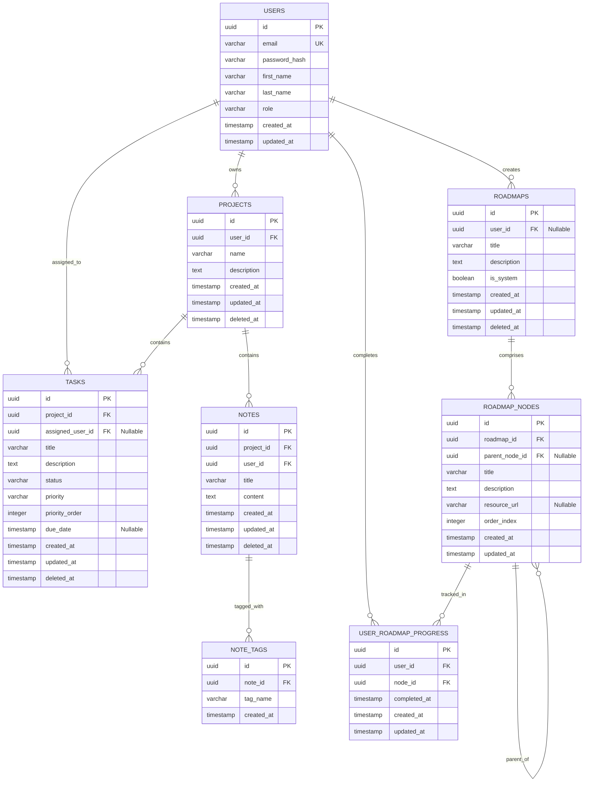

# DevOps Learning Portal (DaemonBoard) — Phase 2: Database Design

This document describes the PostgreSQL database architecture, schemas, indexing profiles, constraints, migrations, and seeding strategy for **DaemonBoard**.

---

## 1. Database Entity-Relationship Diagram (ERD)

The following Mermaid diagram visualizes the tables, column schemas, and constraints:



---

## 2. Core Strategies

### UUID Strategy
- We use the `uuid` data type for all Primary Keys (PKs) instead of auto-incrementing integers. This secures public routing against ID harvesting attacks.
- We generate UUIDs at database level using PostgreSQL's built-in `gen_random_uuid()` (standard in Postgres 13+), or the `uuid-ossp` extension's `uuid_generate_v4()` for older versions.

### Soft Delete Strategy
- Tables containing business and user documents (`projects`, `tasks`, `notes`, `roadmaps`) contain a nullable `deleted_at TIMESTAMP WITH TIME ZONE` column.
- Active records possess a value of `NULL`. Deleting a record updates this column to the current timestamp.
- Indices on these tables are optimized using partial indexes (`WHERE deleted_at IS NULL`) to filter out inactive rows efficiently.

### Audit Columns & Automated Updated Trigger
- Every table maintains `created_at` and `updated_at` timestamps with timezone definitions.
- To prevent applications from having to explicitly manage timestamps, we register a database function and triggers that automatically update the `updated_at` column.

```sql
-- Trigger function definition
CREATE OR REPLACE FUNCTION set_updated_at()
RETURNS TRIGGER AS $$
BEGIN
  NEW.updated_at = CURRENT_TIMESTAMP;
  RETURN NEW;
END;
$$ LANGUAGE plpgsql;
```

---

## 3. Detailed Schema Specification (DDL)

### 1. Users Table
Stores security user profiles and system role privileges.
```sql
CREATE TABLE users (
    id UUID PRIMARY KEY DEFAULT gen_random_uuid(),
    email VARCHAR(255) NOT NULL UNIQUE,
    password_hash VARCHAR(255) NOT NULL,
    first_name VARCHAR(100) NOT NULL,
    last_name VARCHAR(100) NOT NULL,
    role VARCHAR(50) NOT NULL DEFAULT 'user',
    created_at TIMESTAMP WITH TIME ZONE NOT NULL DEFAULT CURRENT_TIMESTAMP,
    updated_at TIMESTAMP WITH TIME ZONE NOT NULL DEFAULT CURRENT_TIMESTAMP,
    CONSTRAINT chk_user_role CHECK (role IN ('user', 'admin'))
);
```

### 2. Projects Table
Groups tasks, roadmaps, and notes into projects.
```sql
CREATE TABLE projects (
    id UUID PRIMARY KEY DEFAULT gen_random_uuid(),
    user_id UUID NOT NULL REFERENCES users(id) ON DELETE CASCADE,
    name VARCHAR(255) NOT NULL,
    description TEXT,
    created_at TIMESTAMP WITH TIME ZONE NOT NULL DEFAULT CURRENT_TIMESTAMP,
    updated_at TIMESTAMP WITH TIME ZONE NOT NULL DEFAULT CURRENT_TIMESTAMP,
    deleted_at TIMESTAMP WITH TIME ZONE
);
```

### 3. Tasks Table
Represents Kanban task cards.
```sql
CREATE TABLE tasks (
    id UUID PRIMARY KEY DEFAULT gen_random_uuid(),
    project_id UUID NOT NULL REFERENCES projects(id) ON DELETE CASCADE,
    assigned_user_id UUID REFERENCES users(id) ON DELETE SET NULL,
    title VARCHAR(255) NOT NULL,
    description TEXT,
    status VARCHAR(50) NOT NULL DEFAULT 'todo',
    priority VARCHAR(50) NOT NULL DEFAULT 'medium',
    priority_order INTEGER NOT NULL DEFAULT 0,
    due_date TIMESTAMP WITH TIME ZONE,
    created_at TIMESTAMP WITH TIME ZONE NOT NULL DEFAULT CURRENT_TIMESTAMP,
    updated_at TIMESTAMP WITH TIME ZONE NOT NULL DEFAULT CURRENT_TIMESTAMP,
    deleted_at TIMESTAMP WITH TIME ZONE,
    CONSTRAINT chk_task_status CHECK (status IN ('todo', 'in_progress', 'review', 'done')),
    CONSTRAINT chk_task_priority CHECK (priority IN ('low', 'medium', 'high'))
);
```

### 4. Notes Table
Holds markdown documents for developers.
```sql
CREATE TABLE notes (
    id UUID PRIMARY KEY DEFAULT gen_random_uuid(),
    project_id UUID NOT NULL REFERENCES projects(id) ON DELETE CASCADE,
    user_id UUID NOT NULL REFERENCES users(id) ON DELETE RESTRICT,
    title VARCHAR(255) NOT NULL,
    content TEXT NOT NULL,
    created_at TIMESTAMP WITH TIME ZONE NOT NULL DEFAULT CURRENT_TIMESTAMP,
    updated_at TIMESTAMP WITH TIME ZONE NOT NULL DEFAULT CURRENT_TIMESTAMP,
    deleted_at TIMESTAMP WITH TIME ZONE
);
```

### 5. Note Tags Table
Enables categorization of notes.
```sql
CREATE TABLE note_tags (
    id UUID PRIMARY KEY DEFAULT gen_random_uuid(),
    note_id UUID NOT NULL REFERENCES notes(id) ON DELETE CASCADE,
    tag_name VARCHAR(50) NOT NULL,
    created_at TIMESTAMP WITH TIME ZONE NOT NULL DEFAULT CURRENT_TIMESTAMP,
    CONSTRAINT uq_note_tag UNIQUE(note_id, tag_name)
);
```

### 6. Roadmaps Table
Learning pathways (e.g. system design, docker, git).
```sql
CREATE TABLE roadmaps (
    id UUID PRIMARY KEY DEFAULT gen_random_uuid(),
    user_id UUID REFERENCES users(id) ON DELETE SET NULL, -- NULL means system template
    title VARCHAR(255) NOT NULL,
    description TEXT,
    is_system BOOLEAN NOT NULL DEFAULT FALSE,
    created_at TIMESTAMP WITH TIME ZONE NOT NULL DEFAULT CURRENT_TIMESTAMP,
    updated_at TIMESTAMP WITH TIME ZONE NOT NULL DEFAULT CURRENT_TIMESTAMP,
    deleted_at TIMESTAMP WITH TIME ZONE
);
```

### 7. Roadmap Nodes Table
Hierarchical steps inside a roadmap tree.
```sql
CREATE TABLE roadmap_nodes (
    id UUID PRIMARY KEY DEFAULT gen_random_uuid(),
    roadmap_id UUID NOT NULL REFERENCES roadmaps(id) ON DELETE CASCADE,
    parent_node_id UUID REFERENCES roadmap_nodes(id) ON DELETE SET NULL,
    title VARCHAR(255) NOT NULL,
    description TEXT,
    resource_url VARCHAR(500),
    order_index INTEGER NOT NULL DEFAULT 0,
    created_at TIMESTAMP WITH TIME ZONE NOT NULL DEFAULT CURRENT_TIMESTAMP,
    updated_at TIMESTAMP WITH TIME ZONE NOT NULL DEFAULT CURRENT_TIMESTAMP
);
```

### 8. User Roadmap Progress Table
Tracks completion marks on specific nodes by users.
```sql
CREATE TABLE user_roadmap_progress (
    id UUID PRIMARY KEY DEFAULT gen_random_uuid(),
    user_id UUID NOT NULL REFERENCES users(id) ON DELETE CASCADE,
    node_id UUID NOT NULL REFERENCES roadmap_nodes(id) ON DELETE CASCADE,
    completed_at TIMESTAMP WITH TIME ZONE NOT NULL DEFAULT CURRENT_TIMESTAMP,
    created_at TIMESTAMP WITH TIME ZONE NOT NULL DEFAULT CURRENT_TIMESTAMP,
    updated_at TIMESTAMP WITH TIME ZONE NOT NULL DEFAULT CURRENT_TIMESTAMP,
    CONSTRAINT uq_user_node_progress UNIQUE(user_id, node_id)
);
```

---

## 4. Query Indexes Optimization

To preserve sub-100ms speeds under heavy data growth:

1. **Foreign Key Indexes**:
   ```sql
   CREATE INDEX idx_projects_user ON projects(user_id) WHERE deleted_at IS NULL;
   CREATE INDEX idx_tasks_project ON tasks(project_id) WHERE deleted_at IS NULL;
   CREATE INDEX idx_notes_project ON notes(project_id) WHERE deleted_at IS NULL;
   CREATE INDEX idx_nodes_roadmap ON roadmap_nodes(roadmap_id);
   ```
2. **Search Vector Index (Fuzzy Lookup)**:
   Used during Search (Phase 12) for scanning notes.
   ```sql
   CREATE INDEX idx_notes_search_vector ON notes USING gin(to_tsvector('english', title || ' ' || content)) WHERE deleted_at IS NULL;
   ```
3. **Ordering Index (Kanban Priority)**:
   Enables fast sorting of cards inside columns.
   ```sql
   CREATE INDEX idx_tasks_sorting ON tasks(project_id, status, priority_order) WHERE deleted_at IS NULL;
   ```

---

## 5. Migration & Rollback Strategy

Migrations are managed via discrete incrementing SQL scripts inside the `backend/src/infrastructure/database/migrations` path.

- **Naming Pattern**: `[timestamp/serial]_[action]_[table].up.sql` and `[timestamp/serial]_[action]_[table].down.sql`.
- **Validation**: All UP and DOWN migrations are execution-tested in a sandbox environment before merging.
- **Example Migration Sequence**:
  - `001_init_extensions.up.sql`: Enables `uuid-ossp` extensions.
  - `002_create_users.up.sql`: Builds the users table.
  - `003_create_projects.up.sql`: Builds projects table with FK reference.

---

## 6. Data Seeding Plan

The data seed execution consists of two phases:

### System Seeding (Required on Setup)
- Installs basic system learning roadmaps:
  - **Docker Core Roadmap**: Core nodes such as "Dockerfiles", "Containers", "Volumes", "Docker Compose".
  - **Linux Admin Roadmap**: Nodes including "File Permissions", "Systemd Services", "User Management".
  - **CI/CD Pipeline Roadmap**: Nodes covering "Github Actions", "Build Packages", "Self-Hosted Runners".

### Demo Mock Seeding (Optional on Dev Boot)
- Seeds a default user administrator (`admin@daemonboard.dev`).
- Seeds an example project workspace ("My DevOps Journey") with standard pre-configured tasks on the Kanban board (e.g. "Install WSL", "Build a Go-App Dockerfile") and connected notes.
